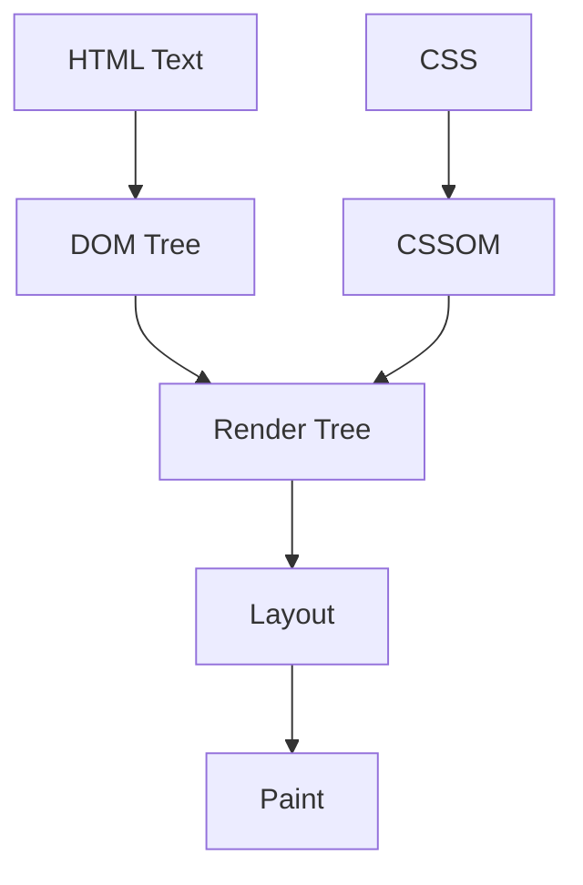

# Theory


## 1. how a browser takes your HTML and turns it into what you see on screen


### In Relation to HTML Rendering
 **Brower** is piece of software that  interpret and render web code. it downloads html code from server, parses it and translates the tags into visual and interactive web pages.

It consists of various structured Bundles of code that are required to perform certin tasks such retrieve of code of webpage ( HTML, CSS, Javascript) to end-user.
These structure bundle are various components of the web browser, Some are 

*Render Engine* which is responsible for retrieving, parsing and translating web code (HTML, CSS)

- DOM Tree
--- 

DOM Tree (Document Object Model) is a tree-like representation of contents of a web-page (html pages) -a tree of "nodes". Each node in the DOM tress represents an elements in HTML code. So programs(Javascript) can read and manipulation  the content, style and structure.


When  a user navigate to a webpage , the HTML document, it served to user as text file. The browser utilizes its HTML parser to convert the HTML text into DOM.


While  HTML defines the structure of the webpage, it may also reference CSS Stylesheets to define the visual presentation of the webpage. The Browser will parse these stylesheet into lookup-efficient data structure call the **CSS Object Model** (CSSOM)  its purpose is to aggregate rulesband provide an efficient lookupnto match selectors to their declared styles.


- Render Tree
---
The final render is constructed by merging both the DOM and CSSOM tree. Render tree contains all the information of visible content including their css style information. The render tree does not include script, meta tags e.t.c as they are not included in the render output.The DOM elements which are hidden through the CSS property are also excluded from the render tree.


- Layout
---
At this stage, the nodes present in the render tree are assigned with their width, height and x - y coordinates on the respective page. The browser determines the size and the location of each node by traversing the render tree from the root element of the render tree to the last node.

The first calculation of the size, position, width and height of nodes is referred to as layout. The recalculation of the node sizes and location are called reflow

- Paint
---
At this stage, the browser converts the calculation done in the layout phase into the actual pixels on the screen. At the painting stage, the elements are filled pixel by pixel on the screen.And this filling of colors is done on numerous surfaces called layers.

### Understanding these matters for a web developers
---
Understanding these matters for a web developers  because it dictates your site performance, overall user experience.

1. understanding the DOM, you understand what JavaScript is actually manipulating. Every querySelector, event listener, or DOM update is operating on this structure of your webpage.

2. Render tree is what the browser actually uses to decide what gets drawn. If something is “in the DOM but not visible,” it likely never reached the render tree such as 

```css
display: none; // visibility to hiddden
```
----
``` html 
<head> 
    <meta>
```
3. when trigger layout repeatedly (e.g., in loops or animations), by using Javascript to manipulate the size of some tag, image e.t.c you can cause performance issues like:
janky scrolling, slow UI updates, frame drops. prefer using opacity and transfom


## 2. what problem QUIC solves and why it matters for users in 2026

### QUIC: HTTP/3 uses QUIC

HTTP/3 is built on QUIC (Quick UDP Internet Connection)

- Better Packet loss handling :

In TCP, If a single packet is lost, everything gets stuck until it is re-sent(refresh the webpage).QUIC splits data into multiple streams so that a lost packet only delays its own specific stream, while the rest load smoothly.

- Faster Page Loads:

TCP requires multiple steps (3-way handshake) to establish a connection, QUIC combines these steps which allows it to transmit secure data immediately.

# Product Thinking

## 1. How does Semantic HTML help search Engine  understand and rank their content

```<article>``` 

Represent self-contained content which announces article boundaries and intended to be distributable or reuable.


